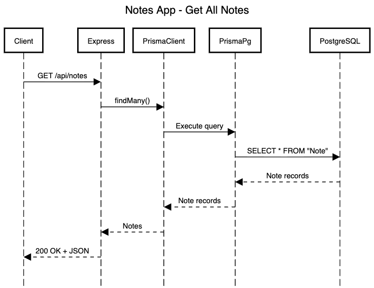
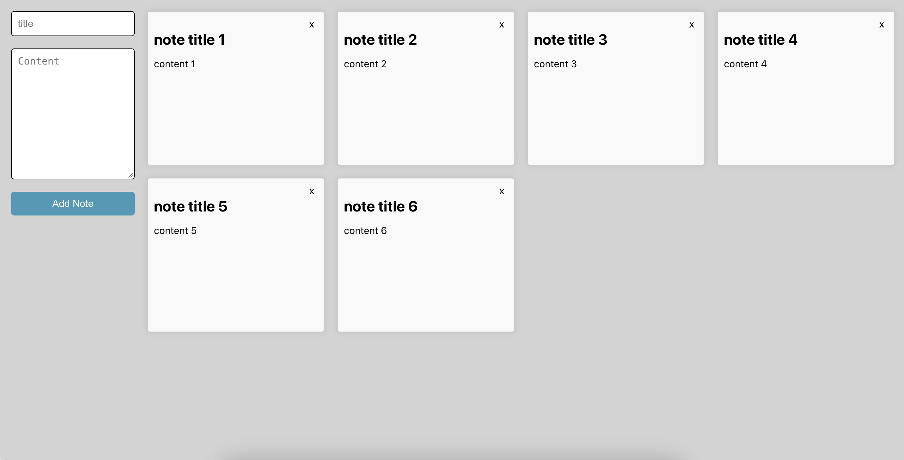

# Notes App Server

A simple REST API built with **Node.js, TypeScript, Express, Prisma, and
PostgreSQL**.

The project started from a tutorial but was updated to work with a
modern local PostgreSQL setup and Prisma 7.

## Tech Stack

-   **Node.js**
-   **TypeScript**
-   **Express**
-   **PostgreSQL**
-   **Prisma 7**
-   **Prisma PostgreSQL adapter**
-   **dotenv**
-   **Nodemon**

## Project Structure

``` text
notes-app-server/
├── prisma/
│   └── schema.prisma
├── src/
│   ├── generated/
│   │   └── prisma/
│   └── index.ts
├── .env
├── prisma.config.ts
├── package.json
└── tsconfig.json
```
### Sequence Diagram



### Important files

#### `src/index.ts`

Main application entry point.

Responsibilities:

-   Creates the Express server
-   Configures middleware
-   Creates the Prisma client
-   Defines API routes
-   Starts the server

Current API:

``` http
GET /api/notes
```

Example:

``` bash
curl http://localhost:5000/api/notes
```

------------------------------------------------------------------------

#### `prisma/schema.prisma`

Defines the database model and Prisma client generation.

``` prisma
generator client {
  provider = "prisma-client"
  output   = "../src/generated/prisma"
}

datasource db {
  provider = "postgresql"
}

model Note {
  id Int @id @default(autoincrement())
  title String
  content String
}
```

The `Note` model contains:

  Field       Type     Description
  ----------- -------- --------------
  `id`        Int      Primary key
  `title`     String   Note title
  `content`   String   Note content

------------------------------------------------------------------------

#### `prisma.config.ts`

Prisma 7 keeps the database connection URL outside `schema.prisma`.

``` ts
import "dotenv/config";
import { defineConfig, env } from "prisma/config";

export default defineConfig({
  schema: "prisma/schema.prisma",
  migrations: {
    path: "prisma/migrations",
  },
  engine: "classic",
  datasource: {
    url: env("DATABASE_URL"),
  },
});
```

------------------------------------------------------------------------

#### `.env`

Local database configuration:

``` env
DATABASE_URL="postgresql://genericduluthdev@localhost:5432/notes_app"
```

The application uses the local PostgreSQL database:

``` text
localhost:5432
    └── notes_app
```

Do **not** commit `.env` to Git.

------------------------------------------------------------------------

#### `package.json`

Contains the project dependencies and start script.

``` bash
npm start
```

The application runs on:

``` text
http://localhost:5000
```

------------------------------------------------------------------------

# Database

PostgreSQL database:

``` text
Database: notes_app
Host:     localhost
Port:     5432
User:     genericduluthdev
```

The `Note` table can be created with:

``` sql
CREATE TABLE "Note" (
    id SERIAL PRIMARY KEY,
    title TEXT NOT NULL,
    content TEXT NOT NULL
);
```

Test data:

``` sql
INSERT INTO "Note" (title, content)
VALUES ('Test title', '');
```

Check the data:

``` sql
SELECT * FROM "Note";
```

------------------------------------------------------------------------

# API

## Get all notes

``` http
GET /api/notes
```

Response:

``` json
[
  {
    "id": 1,
    "title": "Test title",
    "content": ""
  }
]
```

The database query is handled by Prisma:

``` ts
const notes = await prisma.note.findMany();
```

------------------------------------------------------------------------

# Running the Project

Install dependencies:

``` bash
npm install
```

Generate Prisma Client:

``` bash
npx prisma generate
```

Start the server:

``` bash
npm start
```

Test the API:

``` bash
curl http://localhost:5000/api/notes
```

### Frontend example



------------------------------------------------------------------------

# Architecture

``` text
Client
  |
  | HTTP
  v
Express
  |
  v
Prisma Client
  |
  v
PrismaPg Adapter
  |
  v
PostgreSQL
  |
  v
Note table
```

The project intentionally keeps the architecture simple for now. As the
application grows, the next step would be to separate routes,
controllers, services, and database configuration.

# Next Steps

The natural evolution of the API is full CRUD:

``` text
POST   /api/notes       Create
GET    /api/notes       Read all
GET    /api/notes/:id   Read one
PATCH  /api/notes/:id   Update
DELETE /api/notes/:id   Delete
```

After that, useful improvements would be validation, error handling,
migrations, and tests.
